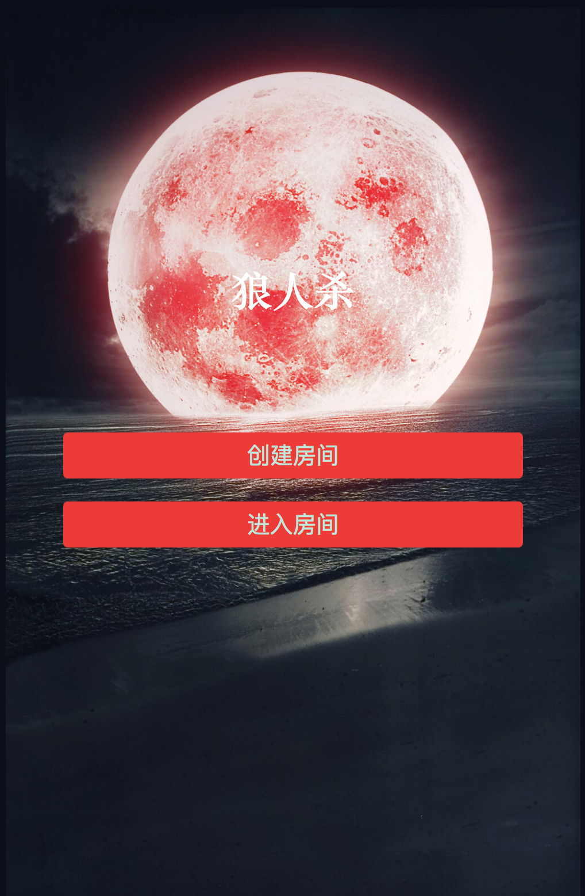
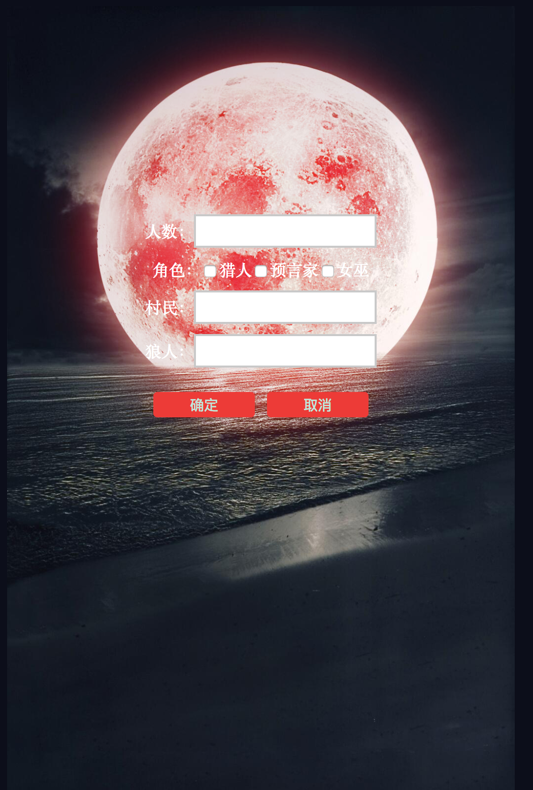
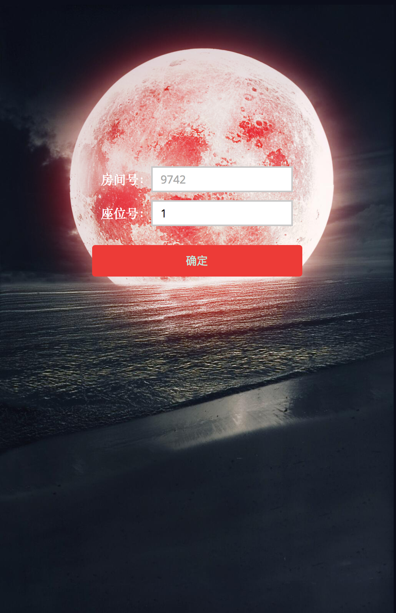

WEREWOLF
============================

## Introduction
This is a pure react front end repo and the server is used [here](https://github.com/wenisy/werewolf-server). 
The judge need to input the game config first then server will return a room number. 
After all people get into the correct room, an excited werewolf game will start.  

## Pages

### Welmcome Page

### Welmcome Page

### Welmcome Page

### Welmcome Page

